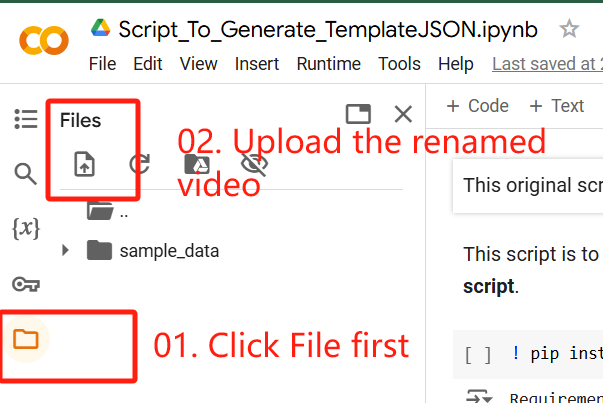
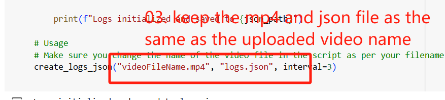

# LeetCode-Experiment-with-AI-Extension
LeetCode Experiment with AI Extension

## Project Goal

This project is dedicated to a systematic exploration of how developers interact with AI tools when tackling LeetCode coding challenges. The primary objective is to analyze and understand the behavioral patterns and actions of developers as they leverage AI assistance in real-time problem-solving scenarios. By capturing detailed usage metrics and interaction data, the project aims to:

- **Assess Interaction Dynamics:**  
  Examine the flow of developer actions and identify common usage patterns when AI tools are employed for coding assistance.

- **Quantify AI Impact:**  
  Evaluate how AI integration influences problem-solving efficiency, decision-making processes, and overall performance during coding exercises.

- **Inform Tool Improvement:**  
  Generate actionable insights that can inform the design and enhancement of future AI-driven coding aids, ensuring they are more intuitive, effective, and aligned with developer needs.

- **Advance Research in Human-AI Collaboration:**  
  Contribute to the broader understanding of the interplay between human problem-solving techniques and AI support systems, with potential implications for coding education and technical interview preparation.

Through a combination of data analytics and user behavior analysis, this project aspires to bridge the gap between AI technology and human expertise, ultimately fostering a more productive and informed coding environment.


## Prerequisites

- Python 3.x installed on your machine
- Code Editor/IDE (VSCode recommended)
- Web browser


## Installation

1. Clone the repository:
   ```bash
   git clone https://github.com/Yogesh31Hasabe/LeetCode-Experiment-with-AI-Extension.git
   ```

2. Navigate to the project directory:
   ```bash
   cd LeetCode-Experiment-with-AI-Extension
   ```

3. Install required dependencies:
   ```bash
   pip install bottle
   ```


## Usage

### Generating `logs.json` file for your video

Before setting up the application, you'll need to generate a logs.json file for your video:

1. Open this Colab in your browser: [Script_To_Generate_TemplateJSON](https://colab.research.google.com/drive/1qN7YgMG7Z6Z3dE8CITzBDamhl70sj9Q3?usp=sharing)
2. Create a Copy of this Colab
3. Upload your video and ensure you change the name of the video file in the script as per your filename. 

4. In `Runtime` section click on `Run All` option
5. Your `logs.json` will be created (Click on Refresh Icon in Files sub-section on left side if file is not visible)
6. Download it to your local machine

### Setting Up Files

1. Locate your video recording and logs.json file
2. Copy both files to the following directory:
   ```
   app_study/static/
   ```

### Running the Application

1. Open a terminal in the `app_study/` directory
2. Run the server using the following command:
   ```bash
   python server.py -p static/<your_logs_fileName>.json -v static/<your_video_fileName>.mp4
   ```
   Replace:
   - `<your_logs_fileName>.json` with your actual logs file name
   - `<your_video_fileName>.mp4` with your actual video file name

### Accessing the Interface

1. Open your web browser
2. Navigate to: `http://localhost:8080/`


## File Structure

```
LeetCode-Experiment-with-AI-Extension/
├── app_study/
│   ├── static/
│   │   ├── your_video_file.mp4
│   │   └── your_logs_file.json
│   └── server.py
└── README.md
```


## License

This project is licensed under the MIT License - see the LICENSE file for details.

